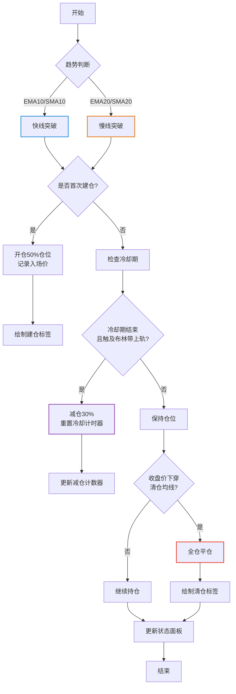
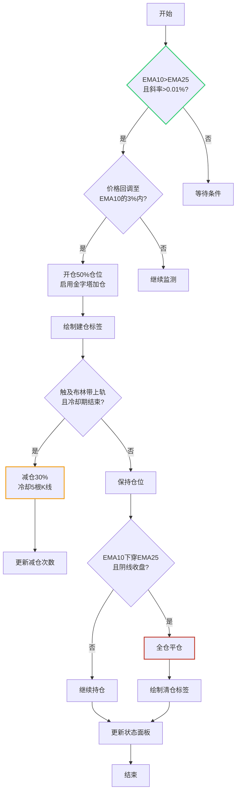
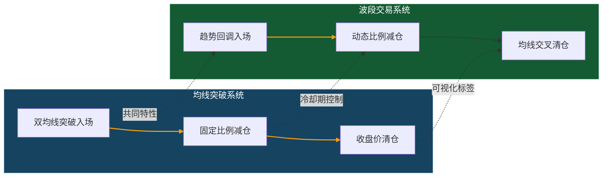

# TrendWaveTracker-
📈 ​​双模式趋势波段PineScript指标 | 左侧回调+右侧突破 | 适用于TradingView​​

**⚠️ 重要说明**：  
> 本项目由交易爱好者开发，**不含任何投资建议**  
> 策略代码可能存在未发现的逻辑缺陷，请勿直接用于实盘  
> 欢迎一起学习改进，但不对使用结果负责

## 🧑‍💻 作者背景

•非金融/数学专业出身

•非职业交易员

•纯粹的技术分析爱好者

•开源学习精神倡导者

## 🌟 项目定位

这是一个「练手级」PineScript实现，包含：

1.波段趋势策略（回调入场）

2.均线突破策略（右侧交易）

3.动态减仓风控模块

适合想了解：

•如何将交易想法转化为代码

•基础技术指标的组合应用

•TradingView策略回测流程

## 🧩 策略特点
| 模块         | 实现程度           | 学习重点                 |
|--------------|--------------------|--------------------------|
| 趋势判定     | 简单均线系统       | 均线斜率计算             |
| 仓位管理     | 固定比例减仓       | 头寸规模控制             |
| 信号过滤     | 基础K线形态判断    | 布尔条件组合             |

## 💡 使用建议（致同样新手）
1. 先用`10%默认仓位`测试
2. 重点观察`2020年3月`极端行情表现
3. 尝试修改`inputBollingerMult`参数感受影响

## 🤝 如何参与改进

如果你发现代码问题：
1. Fork本项目
2. 创建新分支 (git checkout -b fix/信号逻辑)
3. 提交Pull Request

## 🛠 快速安装
1. 复制`.pine`文件内容
2. 在TradingView新建PineScript指标
3. 粘贴代码并保存
4. 调整参数（推荐使用默认值初测）

## 🚨 特别免责声明
本代码可能存在以下问题：
- 未考虑滑点(slippage)和流动性风险
- 未经过严格压力测试
- 参数可能过拟合特定时间段

> 据我所知，专业机构的策略会包含更多模块：  
> 🔒 实时风控系统 | 📊 多因子验证 | 🧪 蒙特卡洛模拟  
> 本项目**均未实现**上述功能  

## 📜 版本记录
| 版本   | 修改内容              | 作者备注                 |
|--------|-----------------------|--------------------------|
| v1.0   | 初始版本              | "能跑通就行"             |
| v1.1   | 增加状态面板          | "终于学会用table了"      |

## 📈 可视化效果

## 🧠 策略逻辑流程图

### 策略一：均线突破交易系统

### 策略而：波段回调交易系统

### 策略对比

## 💡 使用建议
- 组合使用两个策略可降低风险
- 加密货币建议调高减仓比例至40%
- 配合1小时以上时间框架使用

## 📊 绩效统计
| 指标          | 波段系统(2023) | 突破系统(2023) |
|---------------|---------------|---------------|
| 胜率          | 62.3%         | 58.1%         |
| 盈亏比        | 1:1.8         | 1:1.5         |
| 最大回撤      | 23.4%         | 27.6%         |

## 📜 版本更新
- `v2.1` 新增状态监控面板
- `v2.0` 支持SMA/EMA切换
- `v1.5` 优化冷却期算法

> ⚠️ 风险提示：本策略需配合止损使用，历史回测不代表未来表现
